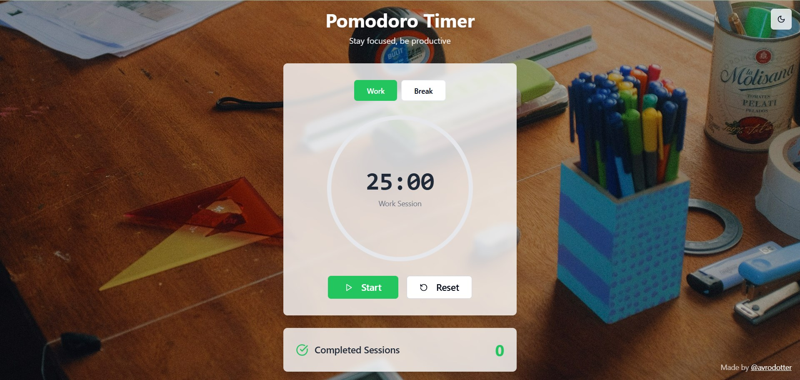
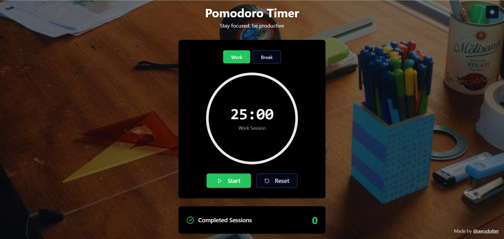

# Pomodoro Zen

A modern Pomodoro timer web application built with React, TypeScript, Vite, and Tailwind CSS. The app helps users stay focused and productive with a clean interface, dark/light mode, and session statistics.

---
## Screenshots

---

## Tech Stack

- **React 18** with TypeScript
- **Vite** (build tool)
- **Tailwind CSS** (utility-first styling)
- **shadcn/ui** (for accessible UI primitives)

---

## Component Structure

- **PomodoroTimer** – Main timer logic and state management
- **CircularProgress** – Custom SVG-based progress indicator
- **SessionStats** – Displays completed session statistics
- **ThemeToggle** – Dark/light mode switching

---

## Core Features

- Pomodoro timer with work/break modes
- Session statistics tracking
- Custom SVG circular progress ring
- Dark/light theme toggle with system preference support
- Responsive design for desktop and mobile
- Clean, modular component architecture

---

## Implementation Details

### State Management

- Uses React hooks (`useState`, `useEffect`, `useRef`) for timer, mode, and session state.
- No external state libraries (like Redux) are used.

### Timer Logic

- Countdown and mode switching handled with `useEffect`.
- Proper interval cleanup to prevent memory leaks.

### Theme System

- Custom theme context using React Context API.
- Persists user preference in `localStorage`.
- Supports system theme detection.

### SVG Progress Ring

- Built from scratch using SVG.
- Dynamically updates based on timer progress and mode.
- Smooth transitions and color changes.

### Session Statistics

- Tracks and displays completed Pomodoro sessions.

---

